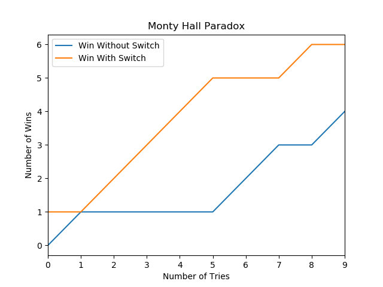
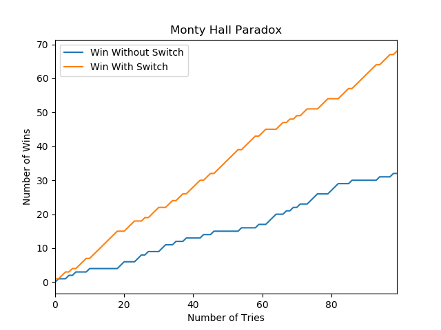
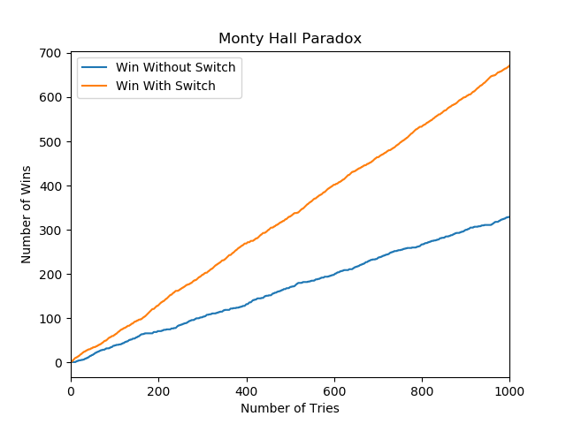
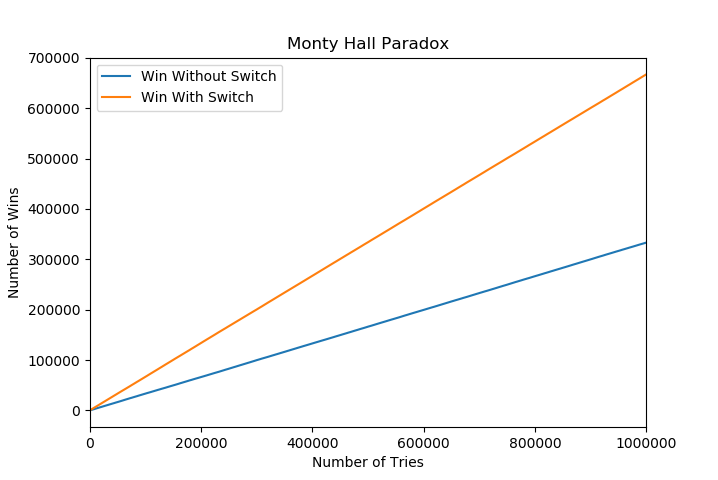

# Monty Hall Paradox

This is the python representation of the simulation of
 famous Monty Hall Paradox
 
 At the beginning of the program user is asked about number
 of tries after which script simulates games and provides 
 final results

1) **game_definition.py** - defines basic rules of the game
such as which door is picked, behind which door is Car and
most importantly what happens in case of switch

2) **game_play.py** - simulates the games and returns two values:
##### The overall probability of winning in case of switching or notswitching 

    Example:
    > Enter Number of Tries : 1000000
    > Win Probability without switch is 33.33 % and in case of switch 66.67 %

##### Visual Representation

1) 10 Tries

 
2) 100 Tries

3) 1000 Tries

4) 1000000 Tries
